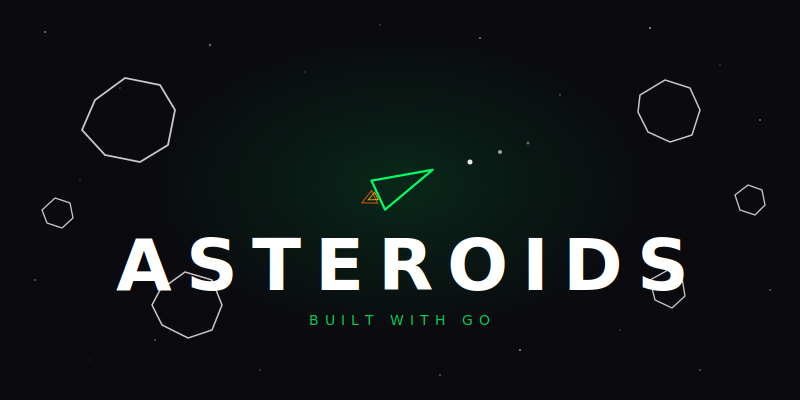
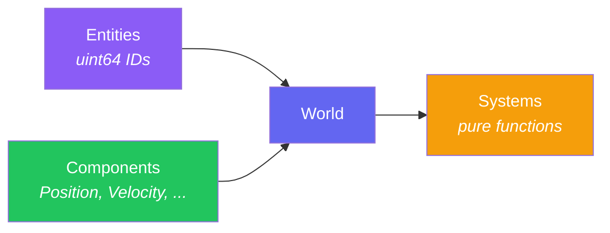

<div align="center">
  

  <p>Everything you see and hear is generated from code. No image files, no audio files, no fonts. Just math.</p>

  <p>
    <a href="https://github.com/matheus3301/asteroids/actions/workflows/ci.yml"></a>
    <a href="https://goreportcard.com/report/github.com/matheus3301/asteroids"></a>
    
    <a href="https://github.com/matheus3301/asteroids/blob/main/LICENSE"></a>
  </p>
</div>

<br>

## Features

- **Classic arcade gameplay** with ship, asteroids, saucers (large & small), hyperspace, wave progression
- **Entity-Component-System architecture** built from scratch, no ECS library
- **100% procedural audio** via sine sweeps, noise bursts, filtered loops, all synthesized at runtime
- **100% vector graphics** where every shape is drawn with vertices, no sprites or images
- **Custom vector font** with stroke-based character rendering for all UI text
- **192 tests**, all headless, no display or audio device required
- **Cross-platform** via [Ebitengine](https://ebitengine.org/) (Linux, macOS, Windows)

## Quick Start

### Prerequisites

- **Go 1.26+** ([install](https://go.dev/dl/))
- **Linux only**: system dependencies
  ```bash
  sudo apt install libc6-dev libgl1-mesa-dev libxcursor-dev libxi-dev libxinerama-dev libxrandr-dev libxxf86vm-dev libasound2-dev pkg-config
  ```

### Run

```bash
make run
```

### Other commands

```bash
make build      # compile to bin/asteroids
make test       # run all tests
make lint       # gofmt check + go vet + golangci-lint
make fmt        # auto-format all .go files
make clean      # remove bin/
```

## Controls

| Action | Keys |
|--------|------|
| Rotate left | `Left Arrow` / `A` |
| Rotate right | `Right Arrow` / `D` |
| Thrust | `Up Arrow` / `W` |
| Shoot | `Space` |
| Hyperspace | `Left Shift` / `Right Shift` |
| Pause | `Escape` |
| Menu select | `Enter` |
| Menu navigate | `Up` / `Down` |

## Architecture

This project is designed to be readable and educational. If you're learning Go game development or want to understand ECS without a framework, start here.

### Project Structure

```
cmd/asteroids/
  main.go              # entry point, creates window, starts game loop

internal/game/
  ecs.go               # Entity type (uint64 ID), World struct, Spawn/Destroy
  components.go        # all component types (Position, Velocity, Rotation, ...)
  systems.go           # all systems (pure functions operating on World)
  factory.go           # entity constructors (SpawnPlayer, SpawnAsteroid, ...)
  game.go              # Game struct, state machine, Update/Draw/Layout
  menu.go              # menu & pause screen logic
  settings.go          # volume settings screen
  render.go            # RenderSystem + drawing helpers
  font.go              # custom vector font (stroke-based characters)
  sound.go             # SoundManager, plays procedural audio via Ebitengine
  sound_gen.go         # audio synthesis (generateFire, generateExplosion, ...)
  *_test.go            # tests for each module
```

### The ECS Pattern

The game uses a hand-rolled Entity-Component-System:



```go
type Entity uint64

// Systems are pure functions
func PhysicsSystem(w *World) {
    for e, pos := range w.positions {
        if vel, ok := w.velocities[e]; ok {
            pos.X += vel.X
            pos.Y += vel.Y
        }
    }
}
```

Each system can be tested in isolation without starting the game engine.

### System Execution Order

Every tick, `updatePlaying()` runs systems in this exact order:

| # | System | Purpose |
|---|--------|---------|
| 1 | `InputSystem` | Read keyboard, update player flags |
| 2 | `PhysicsSystem` | Apply velocity to position, spin to angle |
| 3 | `WrapSystem` | Wrap entities at screen edges |
| 4 | `InvulnerabilitySystem` | Tick down respawn invulnerability |
| 5 | `LifetimeSystem` | Expire bullets and particles |
| 6 | `SaucerSpawnSystem` | Spawn saucers on timer |
| 7 | `SaucerAISystem` | Saucer shooting, movement, edge despawn |
| 8 | `SaucerBulletLifetimeSystem` | Expire saucer bullets |
| 9 | `SaucerDespawnSystem` | Detect saucer left the screen |
| 10 | `HyperspaceSystem` | Teleport player (with 1/16 death risk) |
| 11 | `ShootingSystem` | Spawn player bullets |
| 12 | `CollisionSystem` | Detect all collisions, return events |
| 13 | `CollisionResponseSystem` | React to collisions (score, split, death) |
| 14 | `WaveClearSystem` | Spawn next wave when asteroids exhausted |
| 15 | `SoundSystem` | Drain sound queue, play audio |

### Procedural Audio

All sound is synthesized mathematically at 44100 Hz. No audio files exist in this project:

| Sound | Technique |
|-------|-----------|
| Fire | 80ms sine sweep from 1000 Hz to 200 Hz with linear fade |
| Explosion (L) | 400ms noise burst + 60 Hz sine, exponential decay |
| Explosion (M) | 250ms noise burst + 60 Hz sine, lower mix |
| Explosion (S) | 150ms noise burst, minimal low-end |
| Player death | 800ms noise + 40 Hz rumble, slow decay |
| Thrust | 200ms looping low-pass filtered noise (alpha=0.15) |
| Beat (low) | 60ms sine at low frequency, exponential decay, tempo tied to asteroid count |
| Beat (high) | 60ms sine at high frequency, same envelope |
| Menu blip | 30ms 800 Hz sine, fast decay |
| Menu confirm | 60ms 600 Hz sine, moderate decay |

The beat tempo dynamically adjusts: fewer asteroids = faster heartbeat (interval = `15 + count*4` ticks, clamped to 15..60).

## Game Mechanics

### Scoring

| Target | Points |
|--------|--------|
| Large asteroid | 20 |
| Medium asteroid | 50 |
| Small asteroid | 100 |
| Large saucer | 200 |
| Small saucer | 1000 |

### Rules

- **Extra life** every 10,000 points
- **Player bullets**: max 4 active, 60-tick lifetime
- **Invulnerability**: 120 ticks after respawn (player blinks)
- **Hyperspace**: 30-tick cooldown, 1/16 chance of death on use
- **Saucers**: large saucers shoot randomly; small saucers aim at the player
- **Saucer size**: always large below 10K score, always small above 40K, linear interpolation between
- **Wave progression**: each wave spawns `3 + level` large asteroids

## Testing

All 192 tests run headless, no display, no audio device, no Ebitengine runtime:

```bash
make test
```

Tests use a `newPlaying()` helper that calls `New()` + `reset()` to get a fully initialized `World` without starting the game engine. Systems are tested in isolation by constructing a `World`, adding specific entities, running one system, and asserting results.

## Contributing

```bash
git clone https://github.com/matheus3301/asteroids.git
cd asteroids
make lint && make test
```

## License

[MIT](LICENSE) © [Matheus Monteiro](https://github.com/matheus3301)
